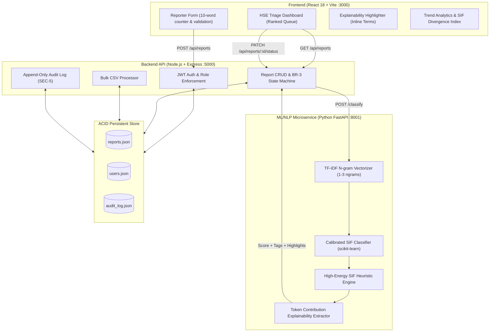

# 🛡️ Prahari (प्रहरी)
### AI/NLP Engine for Serious Injury & Fatality (SIF) Precursor Detection

[](https://sih.gov.in/)
[](#)
[-red.svg)](#)
[](#)
[](#-automated-testing)

---

## 📌 Executive Summary & Problem Context

In large-scale oil & gas upstream operations like **Oil India Limited (OIL)**, frontline engineers, supervisors, and contractors submit thousands of free-text **Unsafe-Act**, **Unsafe-Condition**, and **Near-Miss** reports each year.

### The Critical Safety Paradox
- **Total Recordable Incident Rate (TRIR)** and **SIF (Serious Injury and Fatality)** rates do not move on the same curve. An installation can show an improving low injury rate while still holding deadly exposure to the handful of high-energy fatality modes (falls from height, line of fire, confined space, LOTO bypass, uncontrolled hydrocarbon energy).
- **Subjective Reporter Severity:** Reports are scored based on the outcome rather than the *potential energy*. A report of *"scaffolding without a guardrail with worker standing on it"* is frequently filed as *"Low Severity"* simply because no one fell *today*.
- **Volume Outpaces Human Triage:** HSE officers reading flat, chronological inboxes miss these high-consequence early warning signals before they repeat with fatal luck.

**SIF-Sentinel** resolves this by applying an AI/NLP classification engine grounded in **SIF safety theory** (EPRI & OISD frameworks) to automatically compute an objective **0–100 SIF Precursor Risk Score**, extract inline explainability evidence, and rank the triage queue by risk.

---

## 🏛️ System Architecture



---

## ✨ Core Features & Technical Highlights

1. **Independent SIF Precursor Classifier:**
   - Evaluates pure report description text independently of reporter-assigned severity (SRS FR-2.2).
   - Outputs a calibrated 0–100 score and maps to 8 recognized SIF Hazard Categories:
     - 🏗️ *Work at Height*
     - 🎯 *Line-of-Fire*
     - 🕳️ *Confined Space*
     - ⚡ *LOTO Bypass*
     - 🔨 *Struck-By*
     - 🔥 *Uncontrolled Energy (Wellhead/Gas/Blowout)*
     - 🦺 *PPE Non-Compliance*
     - 🧹 *Housekeeping (De-prioritized)*
2. **Transparent Explainability Layer:**
   - Highlights exact keywords and phrases (`scaffolding`, `guardrail`, `no harness`, `415V`, `H2S alarm`, `3000 PSI`) directly within the text narrative (SRS FR-3.4).
3. **Short Description & Edge Case Guard:**
   - Input with fewer than 10 words (e.g. *"Spill on floor"*) trips the confidence gate and routes to `Needs Manual Review` without guessing (SRS FR-2.6 / EC-1).
4. **Accessible Triage Interface:**
   - Uses multi-modal risk badges combining shape, label, and color (`● HIGH`, `◐ MEDIUM`, `○ LOW`, `⚙ REVIEW`) conforming to WCAG 2.1 AA accessibility (UI/UX Section 14).
5. **Enforced Safety Governance (BR-3):**
   - Implements strict state machine transition: `Submitted` $\rightarrow$ `Reviewed` $\rightarrow$ `Escalated` / `Closed`. Attempting to skip `Reviewed` is blocked with HTTP 400.
6. **Append-Only Audit Trail:**
   - Every creation, classification, and status change is immutably logged with actor, timestamp, and state diffs (SRS FR-5.1 & SEC-5).

---

## 📂 Project Structure

```
sih2/
├── ml_service/                 # Python FastAPI NLP & ML Engine
│   ├── model.py                # SIF Classifier, TF-IDF vectorizer & rule engine
│   ├── main.py                 # FastAPI REST API endpoints
│   └── requirements.txt        # Python dependency specifications
├── backend/                    # Node.js + Express API Backend
│   ├── config.js               # OIL installations, categories, roles
│   ├── database.js             # Persistent ACID JSON datastore
│   ├── auth.js                 # JWT auth, bcrypt passwords, lockout
│   ├── mlClient.js             # Resilient ML client with fallback handling
│   ├── reportService.js        # Validation, state machine, CSV processor
│   ├── server.js               # Express server entry point
│   ├── package.json            # Node dependencies
│   └── .env.example            # Environment template
├── frontend/                   # React 18 + Vite + Tailwind CSS
│   ├── src/
│   │   ├── components/         # Navbar, RiskBadge, ReportDetailModal, BulkImport, Analytics
│   │   ├── pages/              # Login, ReporterHome, TriageDashboard
│   │   ├── context/            # AuthContext session management
│   │   ├── services/           # API fetch client
│   │   ├── App.jsx             # Role-based root router
│   │   └── main.jsx            # Entry point
│   ├── index.html              # HTML shell with Inter & JetBrains Mono fonts
│   ├── tailwind.config.js      # OIL design system color palette
│   └── package.json
├── sample_data/                # Synthetic OIL Field Safety Dataset (26+ reports)
│   └── oil_sif_sample_reports.csv
├── run_services.py             # Single-command Python supervisor
├── start_all.bat               # Windows batch launcher
├── test_e2e.py                 # Automated end-to-end integration test suite
├── .gitignore                  # Git ignore rules
└── README.md                   # Full documentation
```

---

## ⚡ Quickstart Guide

### 1. Prerequisites
- **Node.js**: v18+
- **Python**: 3.9+ with `pip`

### 2. Install Dependencies
```bash
# Install Python ML dependencies
pip install -r ml_service/requirements.txt

# Install Backend dependencies
cd backend && npm install && cd ..

# Install Frontend dependencies
cd frontend && npm install && cd ..
```

### 3. Start All Services

Run the unified supervisor:
```bash
python run_services.py
```
*Or on Windows:*
```cmd
start_all.bat
```

Services will be active at:
| Service | URL |
|---|---|
| 🌐 **Frontend Application** | [http://localhost:3000](http://localhost:3000) |
| ⚙️ **Backend REST API** | [http://127.0.0.1:5000](http://127.0.0.1:5000) |
| 🧠 **FastAPI ML Swagger Docs** | [http://127.0.0.1:8001/docs](http://127.0.0.1:8001/docs) |

---

## 🔐 Demo Credentials

Quick-login role buttons are available directly on the login screen:

| Role | Username | Password | Purpose |
|---|---|---|---|
| **HSE Officer** | `hse@oilindia.in` | `oil123` | Ranked triage queue, explainability, status actions, bulk import |
| **Field Reporter** | `reporter@oilindia.in` | `oil123` | Simplified submission form with word counter, personal report history |
| **HSSE Divisional Head** | `head@oilindia.in` | `oil123` | High-level analytics, SIF precursor divergence, installation breakdown |

---

## 🧪 Automated Testing

Run the automated end-to-end integration test:
```bash
python test_e2e.py
```

### Verified Scenarios:
- ✅ FastAPI ML health and classification latency ($\le 5\text{s}$).
- ✅ Disguised High-Risk report correctly scored $\ge 70$ with *Work at Height* tag.
- ✅ Short text ($<10$ words) guard triggers `Needs Manual Review`.
- ✅ JWT issuance and role-scoping (AUTHZ-2).
- ✅ BR-3 state machine: `Submitted` $\rightarrow$ `Closed` direct jump correctly rejected with HTTP 400.
- ✅ Valid status step progression: `Submitted` $\rightarrow$ `Reviewed` $\rightarrow$ `Escalated` $\rightarrow$ `Closed`.
- ✅ Append-only compliance audit records.

---

## 🎬 3-Minute Jury Demo Flow

1. **Demonstrate Disguised High-Risk:**
   - Log in as **Field Reporter** $\rightarrow$ select preset *"Disguised High Risk (Height)"* $\rightarrow$ Submit with **Low Severity**.
   - Log in as **HSE Officer** $\rightarrow$ see the report at the **top of the triage queue** (scored **86/100 HIGH**).
   - Open detail view $\rightarrow$ note the side-by-side contrast (`Reporter: Low` vs `AI: 86 HIGH`) and inline highlighted phrases.
2. **Demonstrate BR-3 Governance:**
   - Attempt to Close immediately $\rightarrow$ see the interface restrict actions until **Mark as Reviewed** is executed.
3. **Demonstrate Bulk Import & Analytics:**
   - In Bulk Ingestion, click *"One-Click OIL Demo Dataset"* $\rightarrow$ load 26+ records across 8 installations.
   - Switch to **Trend Analytics** $\rightarrow$ review the **SIF Precursor Divergence Index** showing what percentage of fatality risks were hidden inside low-severity logs.

---

## 📜 License
Developed for the **Smart India Hackathon 2026** under the **Oil India Limited (OIL)** KAVACH HSE Initiative.
