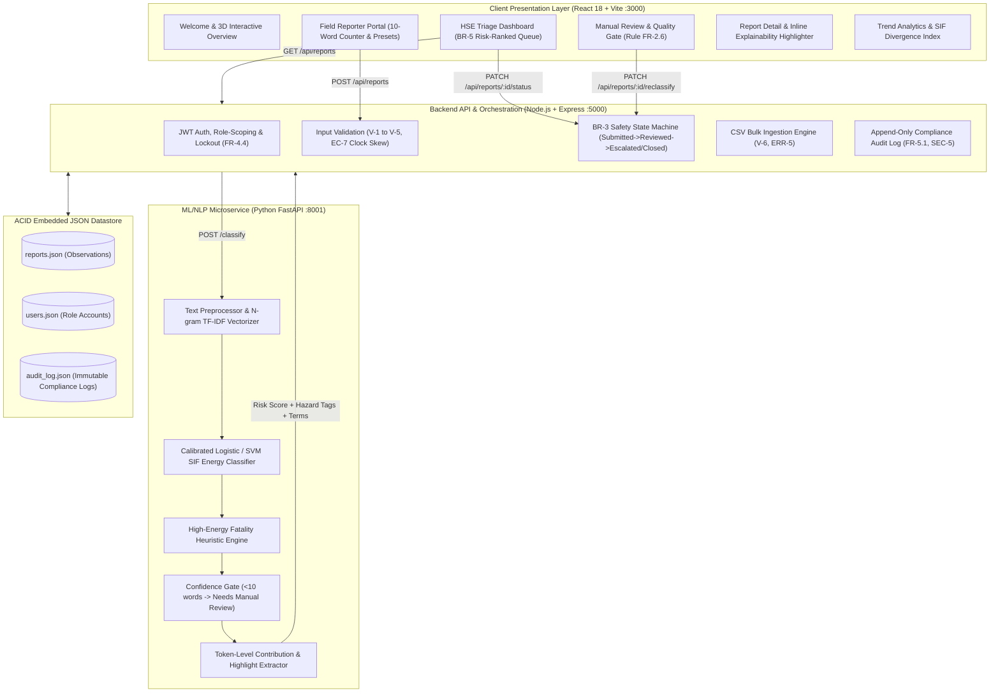

# 🛡️ PRAHARI (प्रहरी)
### AI/NLP Engine for Serious Injury & Fatality (SIF) Precursor Detection

[](https://sih.gov.in/)
[](#)
[-red.svg?style=for-the-badge)](https://www.oil-india.com/)
[](#)
[](#)
[](#-automated-testing--verification)

> **"Prahari" (प्रहरी)** — *The Vigilant Sentinel and Protective Safety Guardian for Oil India Limited's Exploration, Drilling, and Refining Installations.*

---

## 📌 1. Executive Summary & Problem Statement

**Oil India Limited (OIL)** generates thousands of frontline **Unsafe-Act**, **Unsafe-Condition**, and **Near-Miss** reports annually across its upstream assets (Duliajan, Naharkatiya, Baghjan, Moran, Digboi, Jorhat, Kumchai, and Barekuri).

### The SIF Safety Paradox in Upstream Operations
1. **TRIR vs SIF Disconnection:** Total Recordable Incident Rate (TRIR) and SIF (Serious Injury & Fatality) rates do not move on the same curve. An installation can show a decreasing minor injury rate while carrying deadly exposure to fatal energy modes.
2. **Subjective Reporter Severity:** Safety reports are labeled by field personnel based on *actual outcome* rather than *energetic exposure*. A report stating:
   > *"Contractor climbed scaffolding without safety harness near crude separator tank."*
   is often logged as **"Low Severity"** because no one fell *today*.
3. **Volume Outpaces Manual Triage:** HSE officers reading flat, chronological submission inboxes cannot manually detect the high-energy precursors hidden among thousands of routine housekeeping entries.
4. **The Baghjan Context:** The 2020 Baghjan well blowout underscored that catching precursors early in unstructured field text is not an academic exercise—it saves lives and critical national energy infrastructure.

**PRAHARI** solves this with an AI/NLP classification engine grounded in **EPRI & OISD SIF theory**. It scans unstructured field observations, predicts a calibrated **0–100 SIF Precursor Risk Score** independent of reporter-assigned severity, highlights exact explainability evidence, and ranks the HSE triage queue by risk.

---

## 🏗️ 2. System Architecture



---

## ⚡ 3. Key Functional Innovations

| Feature | Description | PRD / SRS Reference |
|---|---|---|
| **Independent SIF Scoring** | Risk scores (0–100) are computed purely from unstructured text and high-energy physics, completely ignoring the reporter's subjective severity label. | SRS FR-2.1, FR-2.2 |
| **8 Recognized SIF Hazard Modes** | Automatically tags: *Work at Height, Line-of-Fire, Confined Space, LOTO Bypass, Struck-By, Uncontrolled Energy, PPE Non-Compliance, Housekeeping*. | SRS Section 1.3, FR-2.3 |
| **Inline Explainability Evidence** | Visually highlights the specific causal phrases (`scaffolding`, `guardrail`, `no harness`, `415V`, `H2S alarm`, `3000 PSI`) inside the original text. | SRS FR-2.4, FR-3.4 |
| **Disguised High-Risk Unmasking** | Equal-weight side-by-side presentation of `Reporter Severity: Low` vs `PRAHARI Score: 86/100 (HIGH)` brings hidden fatal risks to the top. | SRS BR-2, BR-5 |
| **Manual Review Quality Gate** | Reports with $<10$ words or ambiguous language route to `Needs Manual Review` with an inline reclassification panel for HSE officers. | SRS FR-2.6, EC-1, BR-7 |
| **BR-3 State Machine Governance** | Strictly enforces: `Submitted` $\rightarrow$ `Reviewed` $\rightarrow$ `Escalated` / `Closed`. Attempting to close unreviewed items is blocked with HTTP 400. | SRS BR-3, FR-3.5 |
| **Immutable Audit Compliance** | Append-only chronological logging records every submission, classification, review, and status update with actor ID and diffs. | SRS FR-5.1, SEC-5 |
| **SIF Divergence Index** | Analytics dashboard tracks what percentage of high-potential SIF precursors were disguised in low-severity field logs. | PRD F6, G4 |

---

## 🚀 4. Quickstart Guide

### Prerequisites
- **Node.js**: v18+ (Node.js v22 detected)
- **Python**: 3.9+ (Python 3.11 with `fastapi`, `uvicorn`, `scikit-learn` installed)

### Start All Services with 1 Command:
```bash
python run_services.py
```
*(Or double-click `start_all.bat` on Windows)*

The launcher automatically frees any occupied ports (`8001`, `5000`, `3000`), boots all three microservices, and handles graceful shutdown when `Ctrl+C` is pressed.

### Service Endpoints:
| Service | URL | Description |
|---|---|---|
| 🌐 **Frontend Application** | **[http://localhost:3000](http://localhost:3000)** | React 18 + Vite UI with dark/light themes |
| ⚙️ **Backend REST API** | **[http://127.0.0.1:5000](http://127.0.0.1:5000)** | Node.js Express API & JWT server |
| 🧠 **ML NLP Engine Docs** | **[http://127.0.0.1:8001/docs](http://127.0.0.1:8001/docs)** | FastAPI interactive Swagger documentation |

---

## 🔑 5. Pre-configured Demo Accounts

Use the **1-Click Demo Login buttons** on the login screen:

| Role | Username | Password | Default Landing | Scope & Purpose |
|---|---|---|---|---|
| **HSE Officer** *(Priyanka Borah)* | `hse@oilindia.in` | `oil123` | Triage Dashboard | Access to full risk-ranked triage queue, explainability highlights, status updates, manual review queue, and bulk CSV ingestion. |
| **Field Reporter** *(Rahul Sarma)* | `reporter@oilindia.in` | `oil123` | Reporter Portal | Mobile-first observation submission form with live word counter, quick demo presets, and personal submission tracking (scores hidden). |
| **Corporate Head** *(Anupam Dutta)* | `head@oilindia.in` | `oil123` | Trend Analytics | Cross-installation risk profiles, SIF Precursor Divergence Index, and hazard category distributions. |

---

## 🎬 6. 3-Minute Hackathon Jury Walkthrough Script

### 📍 Scenario 1: The "Disguised High-Risk" Precursor (Core Differentiator)
1. Log in as **Field Reporter** (`reporter@oilindia.in`).
2. Select the demo preset: **"Disguised High Risk (Height)"**:
   > *"Found scaffolding without a guardrail near tank 4; contractor was standing on it while no harness was worn."*
3. Notice that the reporter marks severity as **Low** (because nobody was injured).
4. Click **Submit Safety Report**. A reference ID (e.g. `OIL-2049`) is issued with a confirmation screen (risk score hidden from reporter per role design).
5. Use the Navbar quick role swapper to switch to **HSE Officer** (`hse@oilindia.in`).
6. Notice the report is at the **very top of the Triage Queue**, scored as **`86 / 100 HIGH`**.
7. Open the report to show judges:
   - **Equal Visual Weight:** `Reporter Severity: Low` vs `PRAHARI: 86 / 100 (HIGH)`.
   - **Inline Explainability:** Highlights `scaffolding`, `guardrail`, `no harness`, `standing on`.
   - **Hazard Tag:** Accurately classified as **Work at Height**.

### 📍 Scenario 2: Safety State Machine (Rule BR-3 Enforcement)
1. Inside the report detail modal, note that when the report is `Submitted`, only **"Mark as Reviewed"** is available.
2. Click **"Mark as Reviewed"** $\rightarrow$ Status changes to `Reviewed`.
3. Now **"Escalate Incident"** and **"Close Report"** become unlocked.
4. Click **"Audit Trail"** tab to show the immutable compliance log entry with actor and timestamp.

### 📍 Scenario 3: Manual Review & Quality Gate (Rule FR-2.6 & EC-1)
1. Log in as **Field Reporter** and submit: `"Spill on floor"`.
2. Notice the live word counter warns: *3 words (min 10 words)*.
3. Submit the report.
4. Switch to **HSE Officer** $\rightarrow$ click the **`Needs Manual Review: N`** alert badge in the Navbar.
5. The observation is isolated in the **Manual Review Queue** without guesswork.
6. Open the report $\rightarrow$ use the **Manual Classification Panel** to assign *Housekeeping* and *Low Risk* $\rightarrow$ confirm reclassification.

### 📍 Scenario 4: Bulk Ingestion & SIF Divergence Analytics
1. In the HSE dashboard, open **Bulk Ingestion (CSV)**.
2. Click **"One-Click OIL Demo Dataset"** (or upload `sample_data/oil_sif_sample_reports.csv`).
3. 26+ historical reports across 8 OIL installations are batch-classified in milliseconds.
4. Navigate to **SIF Analytics** tab to demonstrate:
   - **SIF Precursor Divergence Index:** Percentage of fatality risks disguised in low-severity logs.
   - **Hazard Breakdown & Field Risk Heatmap:** Cross-installation exposure comparison.

---

## 🧪 7. Automated Testing & Verification

Execute the end-to-end acceptance test suite:
```bash
python test_e2e.py
```

### Verified Acceptance Criteria (100% Pass Rate):
```text
==================================================================
  PRAHARI End-to-End Acceptance Test Suite
==================================================================

[Test 1] Checking ML Service Classification & Explainability...
  [PASS] ML Service Health: OK
  [PASS] Disguised High Risk Test: Scored 86/100 (Band: High), Hazard: Work at Height, Terms: ['scaffolding', 'guardrail', 'harness', 'no harness', 'standing on', 'guardrail near']
  [PASS] Short Description Guard Test (< 10 words -> Needs Manual Review): OK

[Test 2] Starting Express Backend & Testing Auth & Business Rules...
  [PASS] Backend API Health: OK
  [PASS] Seed Sample Reports: System seeded successfully with 26 realistic OIL safety reports!
  [PASS] HSE Officer Login (Priyanka Borah) & JWT Issuance: OK
  [PASS] Field Reporter Login & JWT Issuance: OK
  [PASS] Report Creation & Auto-Classification: ID OIL-6649, SIF Risk: 76/100, Hazard: LOTO Bypass
  [PASS] BR-3 Enforcement (Submitted -> Closed directly rejected): OK
  [PASS] Valid Status Step (Submitted -> Reviewed): OK
  [PASS] Manual Review Reclassification Override (SRS 5.3 & BR-1): OK
  [PASS] Valid Status Step (Reviewed -> Escalated): OK
  [PASS] Valid Status Step (Escalated -> Closed): OK
  [PASS] Append-Only Audit Trail (FR-5.1 & SEC-5): Recorded 6 state changes
  [PASS] KPI Stats: Total=27, High SIF=20, Disguised=14

==================================================================
  ALL ACCEPTANCE CRITERIA & INTEGRATION TESTS PASSED (100%)!
==================================================================
```

---

## 🌐 8. REST API Reference

### Backend Endpoints (`http://127.0.0.1:5000`)
- `POST /api/auth/login` — Authenticate and issue JWT token (with 15-min lockout on 5 consecutive failures).
- `GET /api/auth/me` — Retrieve current authenticated user profile.
- `GET /api/config` — Get pre-configured OIL installations, hazard categories, and severities.
- `GET /api/reports` — Filter and retrieve triage reports (sorted by SIF Risk descending by default).
- `POST /api/reports` — Submit an observation report with server-side validation and synchronous ML classification.
- `POST /api/reports/bulk` — Upload CSV file for batch ingestion and multi-row scoring.
- `GET /api/reports/:id` — Retrieve report detail, explainability phrases, and audit history.
- `PATCH /api/reports/:id/status` — Update report status enforcing BR-3 progression.
- `PATCH /api/reports/:id/reclassify` — Manually override risk and hazard category from manual review.
- `GET /api/stats` — Summary metrics, disguised high-risk counts, and hazard breakdowns.
- `GET /api/audit` — Append-only chronological audit log.
- `POST /api/seed` — Reset and seed the synthetic OIL dataset.

### FastAPI ML Endpoints (`http://127.0.0.1:8001`)
- `POST /classify` — Classify single observation text, return risk score, risk band, primary/secondary hazards, and explainability terms.
- `POST /classify/batch` — High-throughput batch classification for bulk imports.
- `GET /health` — Liveness and model status probe.

---

## 👥 9. Team & Hackathon Information
- **Problem Statement:** SIH26165
- **Organization:** Oil India Limited (OIL)
- **Initiative:** OIL KAVACH HSE Digital Transformation
- **Project Name:** PRAHARI (प्रहरी)
